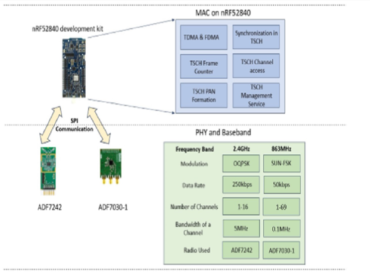
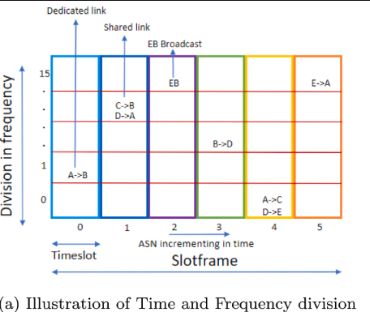

## Overview
DyMAC is a low-power, long-range **Dynamic MAC protocol** designed for Industrial IoT (IIoT) networks. 
It implements the IEEE 802.15.4e TSCH standard on **ARM Cortex M4 (nRF52840)** devices, enabling reliable and scalable wireless communication
This project is MeitY-funded and executed in collaboration with IIT Hyderabad, IIT Bhubaneswar, IISc Bangalore, and CDAC Bangalore.  

The Dynamic MAC provides:  
- **TDMA slotframe structure** for determinism and scalability  
- **FDMA structure** to mitigate interference  
- Multi-hop synchronization and **PAN formation**  
- Clear Channel Assessment using energy thresholding  
- Frequency and channel hopping for reliable communication  
- Frame structures for **Enhanced Beacon, Data Frame, and Enhanced Acknowledgment**  

Platform:  
**Embedded Platform:** Dynamic MAC implementation on ARM Cortex M4 microcontroller

---

## My Role / Contributions
- Developed **Dynamic MAC on ARM M4 microcontroller**  
- Designed **TDMA/FDMA-based MAC API** for enhanced reliability and scalability  
- Implemented **multi-hop synchronization** and PAN formation  
- Tested and optimized **low-power, long-range performance** in real hardware  
- Contributed to **documentation and research publication**

---

## Tech Stack
- **Languages:** C, Embedded C  
- **Hardware:** ARM Cortex M4 (nRF52840), Radios - ADF7242 for 2.4 GHz and ADF7030-1 for 863 MHz 
- **Protocols:** IEEE 802.15.4e-TSCH  
- **Tools / Platforms:** SEGGER Embedded Studio, ns-3, Oscilloscope, Logic Analyzer, FreeRTOS  

---

## Paper & Resources
- 📄 Published Paper: [Dy-MAC: Implementation of Dynamic MAC Stack for IEEE 802.15.4e TSCH](https://www.sciencedirect.com/science/article/abs/pii/S1570870523001889)  
- 🌐 Project Website: [IISc Website](https://eecs.iisc.ac.in/research-highlight/design-of-dynamic-mac-and-phy-soc-for-low-power-and-long-range-networks/) 

---

## Node Setup

  

**Figure:** MAC - nrf52840(cortex M4), PHY Radio - ADF7242, ADF7030-1 

---

## TDMA and FDMA structure

  

**Figure:** Time and Frequency Division

---

## Inside a timeslot

  

**Figure:** components of Tx timeslot

---

  

**Figure:** components of Rx timeslot 

---

## ADF7030-1 Radio FSM

  

**Figure:** FSM of ADF7030-1  

---

## Repository Structure
DyMAC-TSCH
      -Readme.md
      -code
      -images
